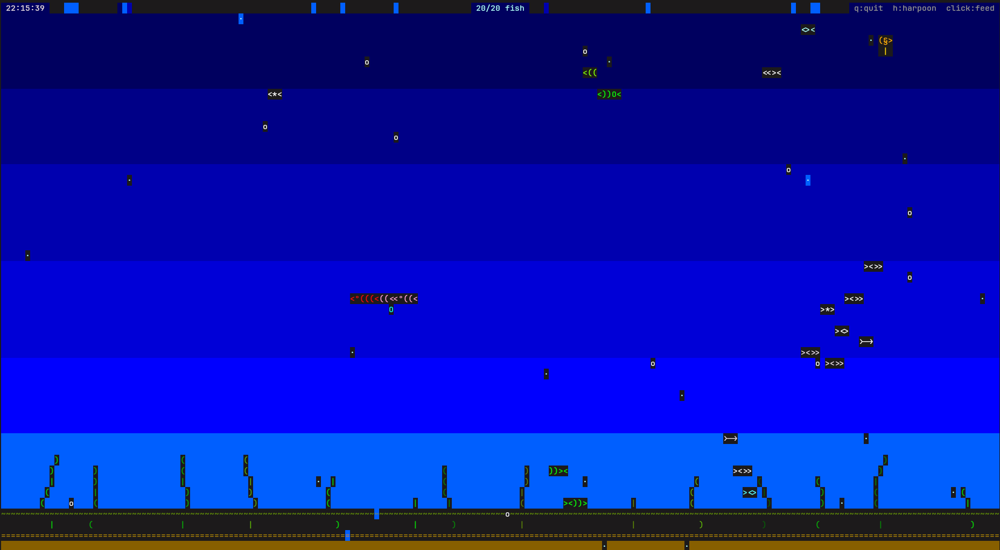

# Asciquarium

A terminal aquarium simulation written in Rust. Fish swim, school, and chase food flakes; bubbles rise; seaweed sways on the sea floor; and occasional visitors (octopuses and seahorses) drift through the tank — all rendered with ASCII characters and ANSI colors.

## Features

- **Fish AI** — four species (small, medium, large, exotic) with wander, schooling, feeding, and avoidance behaviors
- **Interactive feeding** — left-click to drop food; fish swim toward it
- **Harpoon mode** — press `h` to toggle; click fish to remove them
- **Ambient life** — rising bubbles, swaying seaweed, depth-based ocean coloring
- **Visitors** — octopuses and seahorses periodically cross the screen and repel nearby fish
- **HUD** — live clock, active fish count, and context-sensitive control hints
- **Diff-based renderer** — only changed terminal cells are redrawn each frame for smooth ~60 FPS animation
- **Resizable** — adapts when the terminal window is resized

## Requirements

- [Rust](https://www.rust-lang.org/tools/install) (2021 edition)
- A terminal that supports ANSI colors and mouse events (most modern terminals on Linux, macOS, and Windows)

## Quick start

```bash
cargo run --release
```

For a lighter tank:

```bash
cargo run --release -- --fish 10
```

## Controls

| Input | Action |
|-------|--------|
| `q` or `Ctrl-C` | Quit |
| `h` | Toggle harpoon mode |
| Left click | Drop food (normal mode) or kill fish under cursor (harpoon mode) |

## Options

```
Usage: asciquarium [OPTIONS]

Options:
  --fish N    Number of fish to spawn (default: 24, min: 1, max: 200)
  --help      Show help message
```

## Project layout

```
src/
├── main.rs          Entry point, game loop, terminal setup, input handling
├── aquarium.rs      Simulation state and update orchestration
├── renderer.rs      Diff-based terminal renderer
├── vec2.rs          2D vector math
└── entities/
    ├── fish.rs      Fish AI and rendering
    ├── bubble.rs    Rising bubbles
    ├── flake.rs     Food flakes
    ├── seaweed.rs   Swaying plants
    └── visitor.rs   Octopus and seahorse visitors
```

## Dependencies

| Crate | Purpose |
|-------|---------|
| [crossterm](https://crates.io/crates/crossterm) | Raw mode, alternate screen, colors, cursor, mouse |
| [rand](https://crates.io/crates/rand) | Fish spawns, colors, random behavior |
| [chrono](https://crates.io/crates/chrono) | Wall-clock time for the HUD |

## License

No license file is included yet. Add one if you plan to distribute or accept contributions.
