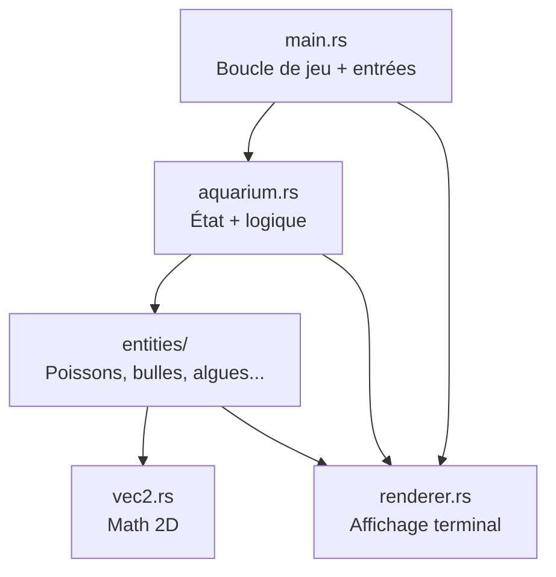

# Cours Rust — Apprendre avec Asciiquarium

Ce projet est un excellent terrain d'apprentissage : il est petit (~1500 lignes), bien commenté, et couvre les concepts Rust les plus importants sans framework lourd. Le code contient déjà des explications pédagogiques dans chaque fichier — ce cours te donne le **parcours** pour les suivre dans le bon ordre.

---

## Prérequis

| Outil | Installation |
|-------|-------------|
| Rust | `curl --proto '=https' --tlsv1.2 -sSf https://sh.rustup.rs \| sh` |
| Terminal ANSI | La plupart des terminaux Linux/macOS/Windows modernes |
| (Optionnel) Debugger | `rust-gdb` ou `rust-lldb` (inclus avec rustup) |

Vérification :
```bash
rustc --version   # ≥ 1.65 recommandé (pour `let ... else`)
cargo --version
```

---

## Vue d'ensemble du projet



**Boucle de jeu** (60 FPS) :
```
poll input (16ms) → update(dt) → render → flush
```

---

## Parcours en 8 étapes — Reproduire le projet

### Étape 0 — Créer le squelette (15 min)

```bash
cargo new asciiquarium
cd asciiquarium
```

Édite `Cargo.toml` :
```toml
[package]
name = "asciiquarium"
version = "0.1.0"
edition = "2021"

[dependencies]
crossterm = "0.28"
rand      = { version = "0.8", features = ["small_rng"] }
chrono    = "0.4"
```

**Concepts Rust appris** : `cargo new`, `Cargo.toml`, édition 2021, dépendances et *features*.

---

### Étape 1 — `vec2.rs` : ton premier type Rust (1h)

Crée `src/vec2.rs` et déclare-le dans `main.rs` :
```rust
mod vec2;
```

**À implémenter** :
- `struct Vec2 { x: f32, y: f32 }`
- `#[derive(Debug, Clone, Copy, Default, PartialEq)]`
- Méthodes : `new`, `length`, `normalized`, `lerp`
- Opérateurs via traits : `Add`, `Sub`, `Mul<f32>`

**Concepts clés** :
| Concept | Où le voir |
|---------|-----------|
| `struct` + `impl` | Séparation données / comportement |
| `Copy` vs `Clone` | Types stack (f32) vs heap (String) |
| `#[derive(...)]` | Génération automatique de traits |
| Traits `std::ops::*` | Surcharge d'opérateurs (`+`, `-`, `*`) |
| Retour implicite | Dernière expression sans `;` = valeur de retour |

**Exercice** : dans `main`, teste :
```rust
let a = Vec2::new(3.0, 4.0);
println!("{:?}", a);           // Debug
println!("{}", a.length());    // 5.0
```

---

### Étape 2 — `renderer.rs` : buffers et I/O (2h)

**À implémenter** :
- `struct Cell { ch, fg, bg }`
- Double buffer (`back_buffer` / `front_buffer`) en `Vec<Cell>` plat
- `put(x, y, ch, fg, bg)` avec index `y * width + x`
- `flush()` : diff entre buffers, n'envoie que les cellules modifiées

**Concepts clés** :
| Concept | Exemple dans le code |
|---------|----------------------|
| `Vec<T>` | Tableau dynamique sur le heap |
| `&mut self` | Emprunt mutable (modifie l'objet) |
| `impl Write` | Généricité par trait (`&mut impl Write`) |
| `?` operator | Propagation d'erreurs I/O |
| `PartialEq` | Comparer deux `Cell` pour le diff |

**Pourquoi un `Vec` plat et pas `Vec<Vec<Cell>>` ?** Meilleure localité mémoire (cache CPU).

---

### Étape 3 — `entities/bubble.rs` : premier "objet de jeu" (1h)

Crée la structure modulaire :
```
src/entities/
├── mod.rs
└── bubble.rs
```

Dans `entities/mod.rs` :
```rust
pub mod bubble;
pub use bubble::Bubble;
```

**À implémenter** :
- `enum BubbleSize { Small, Medium, Large }`
- `struct Bubble` avec position, vitesse, phase
- `new(pos, rng)` — tirage aléatoire
- `update(dt, time, height)` — physique simple
- `draw(renderer)` — rendu

**Concepts clés** :
| Concept | Détail |
|---------|--------|
| `enum` | Types somme (une variante à la fois) |
| `match` | Pattern matching exhaustif |
| `&mut impl Rng` | Généricité avec borne de trait |
| `pub` / `pub use` | Visibilité et réexport de modules |

---

### Étape 4 — `entities/fish.rs` : le cœur du projet (3–4h)

Le fichier le plus riche. Implémente en couches :

1. **Données** : `FishType` (enum), `Fish` (struct)
2. **IA** : `apply_wander`, `apply_feed_seek`, `apply_avoidance`, `integrate`
3. **École** : `compute_school_force` (fonction libre, pas méthode)
4. **Rendu** : `glyph()` selon direction, `draw()`

**Leçon centrale — le borrow checker** :

```rust
// ❌ INTERDIT : emprunt mutable + immutable simultanés
for fish in pool.iter_mut() {
    for other in pool.iter() { ... }  // ERREUR DE COMPILATION
}

// ✅ SOLUTION : pattern en deux passes (dans aquarium.rs)
// Passe 1 : calculer toutes les forces (lecture seule)
let forces: Vec<Vec2> = (0..pool.len())
    .map(|i| compute_school_force(i, &pool, dt))
    .collect();
// Passe 2 : appliquer les forces (écriture)
for (fish, force) in pool.iter_mut().zip(forces.iter()) {
    fish.apply_school_force(*force);
}
```

C'est la leçon Rust la plus importante du projet : **phase lecture → barrière → phase écriture**.

---

### Étape 5 — `entities/` restants (2h)

Dans cet ordre (du simple au complexe) :

| Fichier | Concept nouveau |
|---------|----------------|
| `flake.rs` | Pool d'objets réutilisables (`active: bool`) |
| `seaweed.rs` | Rendu procédural (pas de `update`, juste `draw`) |
| `visitor.rs` | **Enum avec données** (`Visitor::Octopus(OctopusState)`) |

L'enum `Visitor` est un **type algébrique** :
```rust
enum Visitor {
    None,
    Octopus(OctopusState),
    Seahorse(SeahorseState),
}
```
Chaque variante porte exactement les données dont elle a besoin — pas de champs inutiles.

---

### Étape 6 — `aquarium.rs` : orchestration (2h)

`Aquarium` possède tout :
- `Vec<Fish>`, `Vec<Bubble>`, `Vec<Flake>`, `Vec<Seaweed>`
- `Visitor`, `SmallRng`, timers
- `update(dt)` → appelle les sous-systèmes
- `render_to(renderer)` → ordre de dessin (arrière-plan → premier plan)

**Concepts** :
- **Ownership** : `Aquarium` possède ses `Vec`, tout est libéré automatiquement
- `Option<T>` : `kill_msg: Option<(String, Color, f32)>`
- `Default` trait : `impl Default for Config`
- Itérateurs : `.iter().filter().map().min_by()`

---

### Étape 7 — `main.rs` : boucle de jeu + terminal (2h)

**À implémenter** :
1. `CleanupGuard` avec `impl Drop` (RAII)
2. Setup terminal : `enable_raw_mode`, `EnterAlternateScreen`, souris
3. Boucle `loop` avec `event::poll(16ms)`
4. `match` sur `Event::Key`, `Event::Mouse`, `Event::Resize`
5. Calcul `dt` avec `Instant::now()`

**Concepts** :
| Concept | Détail |
|---------|--------|
| `fn main() -> Result<()>` | Erreurs propagées depuis main |
| `Drop` trait | Nettoyage automatique (même en cas de panic) |
| `let _guard = CleanupGuard` | Le `_` nommé garde le guard vivant jusqu'à la fin de scope |
| `BufWriter` | Buffering des écritures terminal |
| Labels de boucle | `'main_loop: loop { break 'main_loop; }` |
| Match guards | `Event::Key(k) if k.code == KeyCode::Char('q')` |

---

### Étape 8 — Polish et options CLI (1h)

- Parser `--fish N` et `--help` (sans crate externe)
- HUD : horloge (`chrono`), compteur de poissons, mode harpon
- Gradient océan, sol marin, notifications de kill

Lance :
```bash
cargo run --release
cargo run --release -- --fish 10
```

---

## Guide de lecture du code — Par concepts Rust

Le projet est commenté fichier par fichier. Voici l'ordre de lecture recommandé :

### Niveau débutant (semaine 1)
1. `vec2.rs` — types, méthodes, traits
2. `entities/bubble.rs` — enum, struct, RNG
3. `entities/flake.rs` — bool flags, casts `as`
4. `renderer.rs` — Vec, emprunts, I/O

### Niveau intermédiaire (semaine 2)
5. `entities/seaweed.rs` — ranges, rendu procédural
6. `entities/visitor.rs` — enums avec données, match exhaustif
7. `aquarium.rs` — ownership, itérateurs, pattern deux passes

### Niveau avancé (semaine 3)
8. `entities/fish.rs` — IA, slices `&[Fish]`, fonctions libres
9. `main.rs` — RAII, game loop, gestion d'événements
10. `entities/mod.rs` — système de modules, réexports

### Tableau de correspondance Rust ↔ ce projet

| Concept Rust | Fichier | Ligne de code à étudier |
|-------------|---------|------------------------|
| Ownership | `aquarium.rs` | `Aquarium` possède tous les `Vec` |
| Borrowing `&` / `&mut` | `aquarium.rs` | `update_fish` deux passes |
| `Option<T>` | `fish.rs` | `apply_feed_seek(nearest_flake: Option<Vec2>)` |
| `Result<T,E>` + `?` | `main.rs` | `enable_raw_mode()?` |
| `match` exhaustif | `main.rs` | Gestion des `Event` |
| `enum` simple | `fish.rs` | `FishType` |
| `enum` avec données | `visitor.rs` | `Visitor::Octopus(...)` |
| Traits + derive | `vec2.rs` | `#[derive(Clone, Copy)]` |
| Traits manuels | `vec2.rs` | `impl Add for Vec2` |
| `Drop` / RAII | `main.rs` | `CleanupGuard` |
| Génériques | `fish.rs` | `rng: &mut impl Rng` |
| Itérateurs | `aquarium.rs` | chaîne `.iter().filter().map()` |
| Slices | `fish.rs` | `pool: &[Fish]` dans `compute_school_force` |
| Modules | `entities/mod.rs` | `pub mod`, `pub use` |
| `String` vs `&str` | `aquarium.rs` | `format!("...")` pour kill_msg |
| Casting `as` | partout | `pos.x as u16` |
| `if let` / `let else` | `main.rs`, `aquarium.rs` | `let Some(config) = parse_config() else { ... }` |

---

## Déboguer ce projet

### 1. `println!` / `dbg!` — le plus simple

Pour inspecter une valeur sans casser le terminal :

```rust
// Dans fish.rs, temporairement :
dbg!(self.pos, self.vel);  // affiche fichier:ligne + valeurs

// Ou classique :
eprintln!("fish {} pos={:?} vel={:?}", idx, fish.pos, fish.vel);
```

**Astuce** : utilise `eprintln!` (stderr) plutôt que `println!` (stdout), car stdout est en mode raw/alternate screen.

Pour ne pas polluer l'affichage, logue seulement quand tu appuies sur une touche debug, ou écris dans un fichier :
```rust
use std::fs::OpenOptions;
use std::io::Write;

let mut f = OpenOptions::new().create(true).append(true).open("/tmp/aqua.log").unwrap();
writeln!(f, "dt={dt} fish_count={}", aquarium.fish.len()).unwrap();
```

---

### 2. `cargo check` vs `cargo build` vs `cargo run`

```bash
cargo check          # Vérifie les types, très rapide — utilise ça en boucle
cargo build          # Compile en mode debug (symboles inclus)
cargo run            # Compile + exécute
cargo run --release  # Optimisé, plus dur à déboguer
```

Les **erreurs du borrow checker** sont ton meilleur outil de debug à la compilation. Lis-les attentivement — elles indiquent exactement quelle durée de vie pose problème.

---

### 3. Debugger avec `rust-gdb` / `rust-lldb`

**Problème spécifique** : cette app utilise le mode raw du terminal. Le debugger interagit mal avec ça. Solution : désactive temporairement le raw mode, ou débogue une fonction isolée.

#### Option A — Déboguer une fonction unitaire

Ajoute dans `src/vec2.rs` :
```rust
#[cfg(test)]
mod tests {
    use super::*;

    #[test]
    fn test_length() {
        let v = Vec2::new(3.0, 4.0);
        assert_eq!(v.length(), 5.0);
    }
}
```

```bash
cargo test                    # Lance les tests
rust-gdb target/debug/deps/asciiquarium-*.so  # ou utilise l'extension Cursor
```

#### Option B — Déboguer `main` avec GDB

```bash
cargo build    # mode debug, pas --release
rust-gdb target/debug/asciiquarium
```

Dans GDB :
```
break main.rs:281          # breakpoint dans la boucle update
break aquarium.rs:374      # breakpoint update_fish
run
continue
print aquarium.fish[0].pos
print dt
backtrace                  # pile d'appels si panic
```

#### Option C — Debugger dans Cursor / VS Code

Crée `.vscode/launch.json` :
```json
{
    "version": "0.2.0",
    "configurations": [
        {
            "type": "lldb",
            "request": "launch",
            "name": "Debug Asciiquarium",
            "cargo": {
                "args": ["build", "--bin=asciiquarium"],
                "filter": { "name": "asciiquarium", "kind": "bin" }
            },
            "args": ["--fish", "5"],
            "cwd": "${workspaceFolder}"
        },
        {
            "type": "lldb",
            "request": "launch",
            "name": "Debug Tests",
            "cargo": {
                "args": ["test", "--no-run"],
                "filter": { "name": "asciiquarium", "kind": "lib" }
            },
            "cwd": "${workspaceFolder}"
        }
    ]
}
```

Installe l'extension **CodeLLDB** dans Cursor, place des breakpoints (clic dans la marge), puis F5.

---

### 4. Déboguer les panics

Quand le programme crash :

```bash
RUST_BACKTRACE=1 cargo run
# ou pour la trace complète :
RUST_BACKTRACE=full cargo run
```

Tu verras la pile d'appels Rust (pas juste l'assembleur). Les panics courantes dans ce projet :
- **Index out of bounds** : accès `back_buffer[idx]` hors limites
- **unwrap sur None** : `partial_cmp(...).unwrap()` si NaN (rare)
- **Terminal non restauré** : si tu commentes `CleanupGuard` — ton shell reste cassé

---

### 5. `cargo clippy` — le linter

```bash
cargo clippy
```

Clippy signale les idiomes non-Rust, les emprunts inutiles, les `clone()` évitables. Excellent pour apprendre les conventions.

---

### 6. Techniques de debug spécifiques à ce projet

| Problème | Comment investiguer |
|----------|-------------------|
| Poissons qui disparaissent | Breakpoint dans `try_harpoon`, log `fish.active` |
| Poissons qui téléportent | Log `dt` dans la boucle — si > 0.05, le clamp rate |
| Flicker à l'écran | Compte les cellules modifiées dans `flush()` |
| Terminal cassé après crash | Vérifie que `CleanupGuard` est bien en scope |
| Souris ne répond pas | `EnableMouseCapture` appelé ? Terminal compatible ? |
| Poissons ne mangent pas | Log distance dans la boucle flake/fish (seuil 1.5) |
| Resize casse l'affichage | Breakpoint sur `Event::Resize`, vérifie `force_redraw()` |

**Mode debug visuel** — ajoute temporairement dans `draw_hud` :
```rust
let debug = format!(" dt:{:.3} ", dt);
renderer.put_str(0, 1, &debug, Color::White, Color::Reset);
```

---

### 7. Profiler les performances

```bash
cargo build --release
time cargo run --release -- --fish 200
```

Si c'est lent, le goulot est probablement `renderer.flush()` — compte combien de cellules changent par frame.

---

## Exercices progressifs pour solidifier

| # | Exercice | Concepts |
|---|----------|----------|
| 1 | Ajouter un nouveau type de poisson `FishType::Shark` | enum, match |
| 2 | Faire respawn les poissons harpoonnés après 10s | `Option`, timers |
| 3 | Ajouter une touche `f` qui nourrit automatiquement | input handling |
| 4 | Sauvegarder le meilleur score dans un fichier | `std::fs`, `Result` |
| 5 | Écrire des tests pour `compute_school_force` | `#[test]`, slices |
| 6 | Remplacer `SmallRng` par une seed fixe pour reproduire un bug | `SeedableRng` |
| 7 | Ajouter un mode pause avec `p` | game state, `bool` flag |

---

## Résumé — Par où commencer aujourd'hui

```
Jour 1   : Étapes 0–1 (cargo + vec2) + cargo check en boucle
Jour 2   : Étapes 2–3 (renderer + bulles) + premier cargo run (écran vide)
Jour 3   : Étape 4 (poissons) — lis les commentaires dans fish.rs
Jour 4   : Étapes 5–6 (autres entités + aquarium)
Jour 5   : Étape 7 (main.rs, boucle complète) → aquarium fonctionnel !
Jour 6   : Étape 8 (polish) + exercices
Jour 7   : Setup debugger + premier test unitaire
```

Le code source de ce repo est déjà ton manuel : chaque fichier commence par un bloc `// RUST CONCEPT:` qui explique exactement ce que tu apprends. Suis les étapes ci-dessus pour les reconstruire toi-même, puis relis le code final pour comparer.

Si tu veux, je peux créer un fichier `COURS.md` dans le repo, ou t'accompagner étape par étape en commençant par l'étape 1 (vec2) avec du code à écrire ensemble.